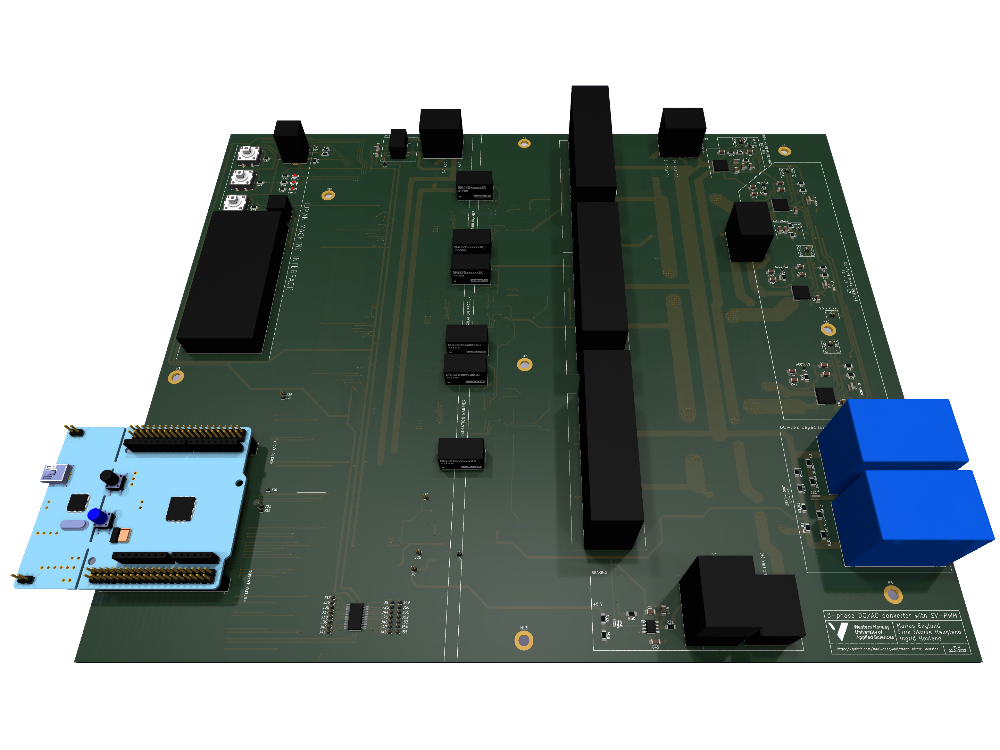
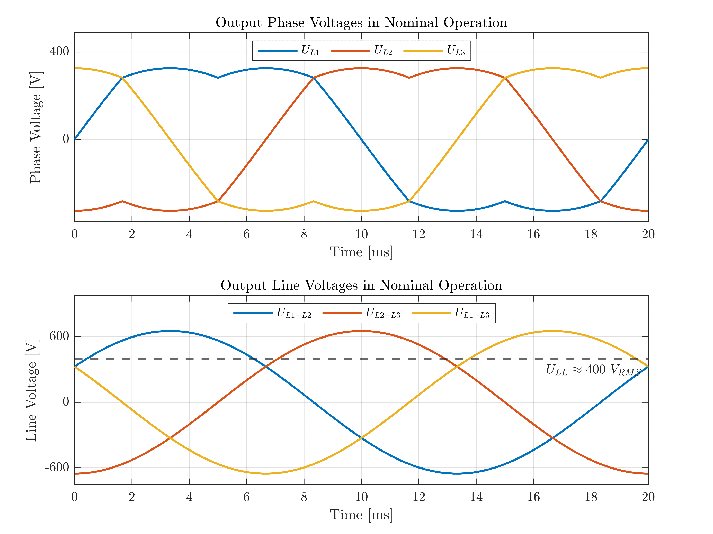

# 3-phase DC/AC converter with SV-PWM
This repository holds materials of our bachelor's thesis carried out at the Western Norway University of Applied Sciences (HVL), Department of Computer Science, Electrical Engineering and Mathematical Sciences in the spring of 2023.

The thesis can be found at [HVL Open](https://hdl.handle.net/11250/3105460).

> We hope that this report will serve as a valuable resource for those who are interested in the field, and we encourage further development of the provided resources.

## About the Project
The project was aimed at realizing the design and fabrication of a three-phase DC-to-AC converter utilizing the Space Vector Pulse Width Modulation (SV-PWM) algorithm.

   
   &nbsp; &nbsp; &nbsp; &nbsp;
   

## Further Work
For suggestions on further work, please refer to the thesis.

## Available Resources
In order to facilitate further advancement, the following resources are made accessible from this repo:

* [PCB design files](pcb-design-files)
* [Source code](source-code)
* [Simulation files](simulation-files)

The repository also contains a [laboratory exercise proposal](/laboratory-exercise/laboratory-exercise-proposal.pdf) that makes use of the inverter. It is worth noting that this exercise is presented in Norwegian.

## License
The resources provided in this repository are released under the GNU General Public License. See the [LICENSE](LICENSE) file for more information.